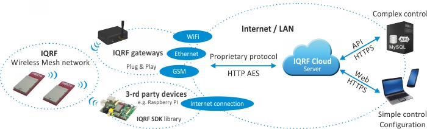

### IQRF DPA over SPI/UART C API
```
This is DPA over SPI/UART C API for easy integration of any IQRF mesh network (coordinator & nodes). 
FreeRTOS is required as so platform specific implementation of dma_handler + spi/uart_handler.
```
Following article is taken from: https://www.iqrf.org/iqrfabout  
IQRF is a platform for low power, low speed and low data volume wireless connectivity ranging tens and hundreds of meters (up to several kilometers in special cases or in networks) e.g. for telemetry, industrial control and automation of buildings and cities (street lights, parking etc.). It can be used with any electronic equipment, whenever there is a need of wireless transfer, e.g. remote control, monitoring of remotely acquired data or connection of more devices to a wireless network.



* RF bands: free ISM *868 MHz*, *916 MHz* and *433 MHz* (world-wide)
* Based on transceivers with built-in operating system (OS) and optional DPA communication layer
* Fully open user-specific functionality depends solely on application software inside:
  * Using ready framework under DPA
    * For many applications requested functionality is achieved without programming at all.
    * For uncommon applications further extensions or modifications can be easily programmed (in C language).
  * In special cases application SW can completely be programmed by the user (under OS, in C language, without DPA).
* IQRF is suitable also for simple peer-to-peer communication but its highest strenght is in complex mesh networks.
* Packet-oriented communication, max. 64 B per packet
* RF range: hundreds of meters in free space and tens of meters in buildings per hop, up to 240 hops per packet
* Extra low power consumption: sub-µA standby, as low as *15 µA* receiving
* RF bit rate: about 20 kb/s
* No infrastructure needed, no license and carrier fees

IQRF is a complete ecosystem from one brand including hardware (transceivers, gateways, routers, accessories, development tools), software, protocols, support and services. IQRF network can easily be connected to Internet via the Cloud server. IQRF is ideal to implement Internet of Things.
